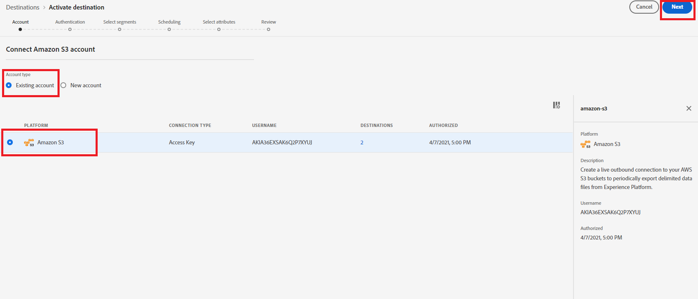
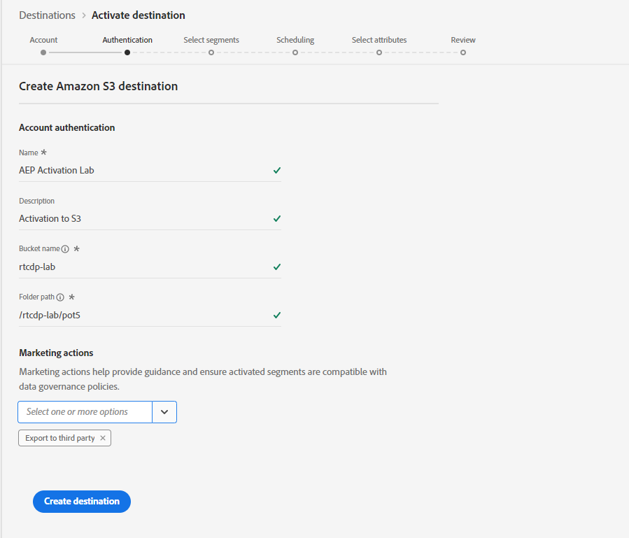
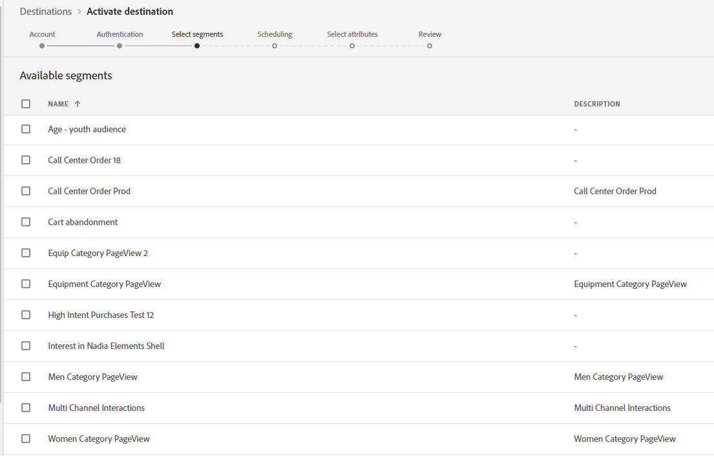
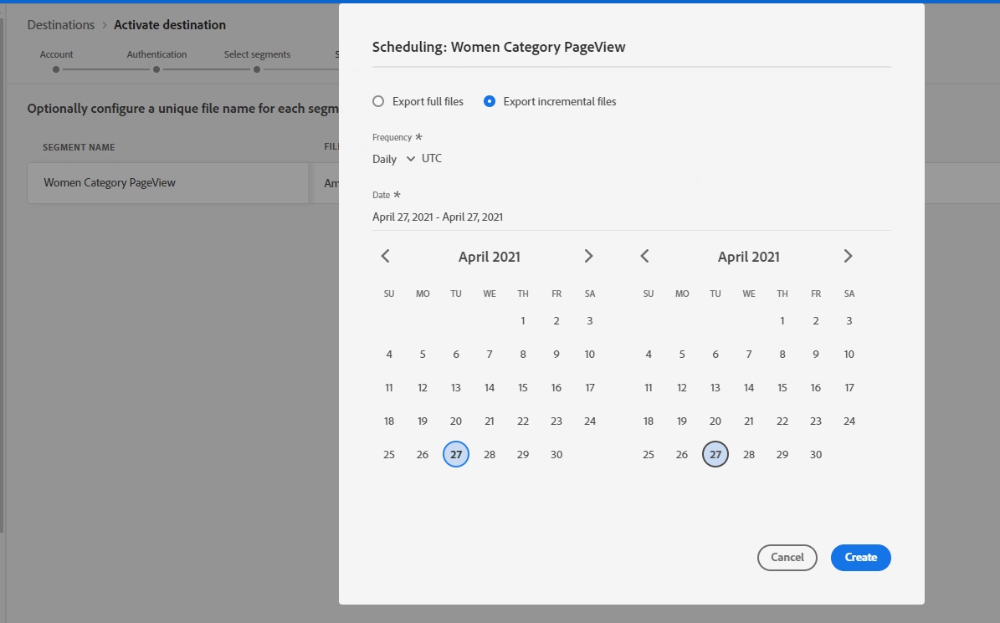
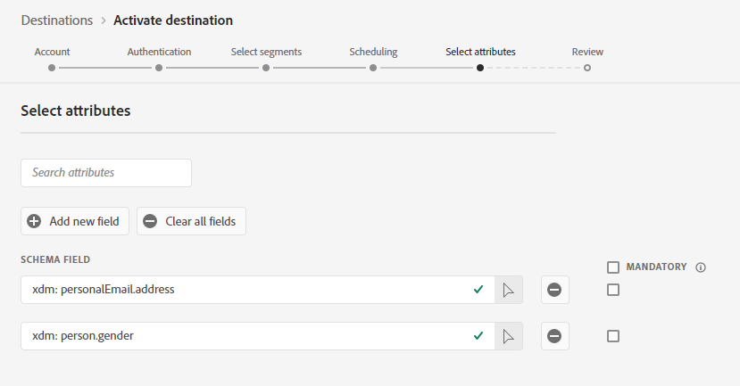
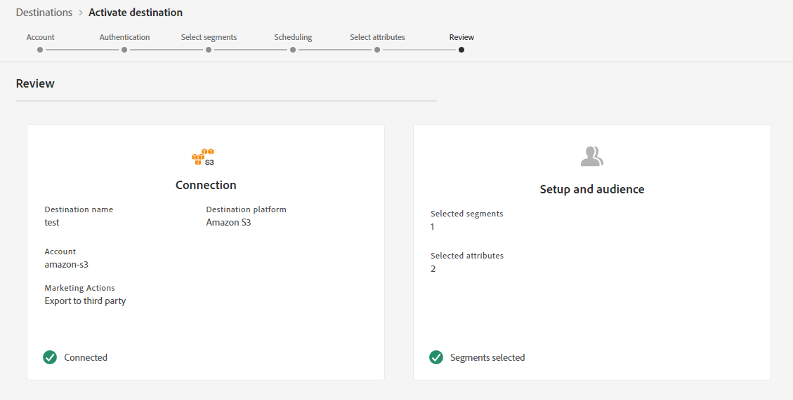

Lab  - Activation Workflow  
==========
<table style="border-collapse: collapse; border: none;" class="tab" cellspacing="0" cellpadding="0">

<tr style="border: none;">

<td width="600" style="border: none;">
<table>
<tbody valign="top">
      <tr width="500">
            <td valign="top"><h3>Objective:</h3></td>
            <td valign="top"> In this exercise, we’ll create an Instance of Attribution AI. 
            </td>
     </tr>
     <tr width="500">
           <td valign="top"><h3>Prerequisites:</h3></td>
           <td valign="top"> Services</td>
     </tr>
</tbody>
</table>
</td>

<td style="border: none;" valign="top">

<table>
<tbody valign="top">
      <tr>
            <td valign="middle" height="70"><b>section</b></td>
            <td valign="middle" height="70"></td>
      </tr>
      <tr>
            <td valign="middle" height="70"><b>version</b></td>
            <td valign="middle" height="70">1</td>
      </tr>
      <tr>
            <td valign="middle" height="70"><b>Date</b></td>
            <td valign="middle" height="70">2021-05-18</td>
      </tr>
</tbody>
</table>
</td>

</tr>
</table>

Instructions:
-----------------
1.	Go to https://platform.adobe.com/home. 
2.	Please ensure that you are in your allotted sandbox for this exercise.
3.	In the left-hand menu, navigate to Services and click on Open within the Attribution AI section. 

4. Click Create Instance

3.	Select 'Activate'. You have two choices for Account type: 'Existing account' and 'New account'. Keep the default selection for 'Existing account'. Select the radio button to the left of the Amazon S3 destination and click 'Next' in the upper right corner.

 
4.	In the 'Authentication' screen, enter the following values: 
      Name: AEP Activation 
      Description: Activation to S3
      Bucket-name: rtcdp-lab
      Folder-path: /rtcdp-lab/pot5
      Marketing actions: Export to third party

 
5.	Select 'Create destination'. Then select 'Next' in the upper right corner.

6.	On the 'Select segments' screen, select the segments you created in the previous lab (Segments).

8.	Click on ‘Next’ in the upper right corner of the workflow. This will take you to the 'Scheduling' step. Open the 'Schedule' settings and select 'Export incremental files'. Select the current date in the calendar.

9.	Click on 'Next' in the upper right corner of the workflow. Clear all fields. Add two new fields:
      person.gender
      personalEmail.address

10.   Click on 'Next' in the upper right corner of the workflow. This will take you to the the 'Review' step. Select 'Finish' to complete the Profile Activation.

 
 
 

Return to [Lab Agenda Directory](https://github.com/adobe/AEP-Hands-on-Labs/blob/master/labs/retail/README.md#lab-agenda)
